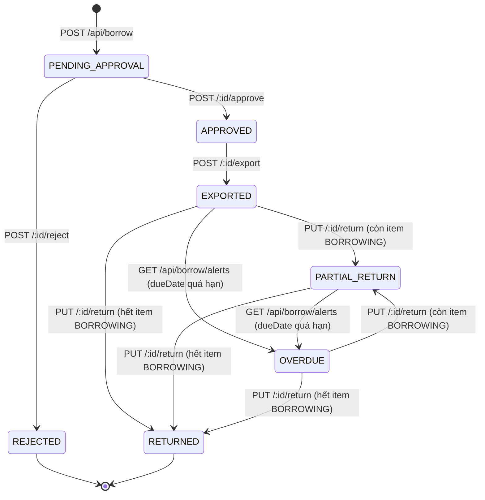

# Mượn & Trả Hồ Sơ — Nguồn Chân Lý Duy Nhất

> **Đây là tài liệu chuẩn (single source of truth) cho tính năng mượn/trả hồ sơ.**
> Comment trong `prisma/schema.prisma` đã lệch khỏi code thật (xem [§8.1](#81-comment-trong-schema-sai-với-code-thật)) — đừng suy luận state machine từ đó. Khi code và tài liệu này lệch nhau, **cập nhật tài liệu này trong cùng PR**, đừng để nó rã ra thêm.
>
> Cập nhật lần cuối: 2026-09-15, đối chiếu trực tiếp với code tại commit `33e334a` + các thay đổi RBAC (gộp `BASIC_VIEWER` vào `VIEWER`) chưa commit cùng ngày.

## Mục lục

1. [Khái niệm](#1-khái-niệm)
2. [Mô hình dữ liệu](#2-mô-hình-dữ-liệu)
3. [Trạng thái & chuyển trạng thái](#3-trạng-thái--chuyển-trạng-thái)
4. [Quyền hạn theo hành động](#4-quyền-hạn-theo-hành-động)
5. [Luồng nghiệp vụ — từng endpoint](#5-luồng-nghiệp-vụ--từng-endpoint)
6. [Sự kiện lịch sử (BorrowSlipEvent)](#6-sự-kiện-lịch-sử-borrowslipevent)
7. [Bất biến bắt buộc giữ](#7-bất-biến-bắt-buộc-giữ)
8. [Lỗi & khoảng hở đã biết](#8-lỗi--khoảng-hở-đã-biết)
9. [Giả định đang đúng — nhưng chỉ nhờ ràng buộc khác](#9-giả-định-đang-đúng--nhưng-chỉ-nhờ-ràng-buộc-khác-không-phải-do-logic-tính-năng-này-bảo-vệ)
10. [Checklist bắt buộc khi sửa tính năng này](#10-checklist-bắt-buộc-khi-sửa-tính-năng-này)
11. [Test hiện có & test còn thiếu](#11-test-hiện-có--test-còn-thiếu)
12. [Lịch sử thay đổi tài liệu](#12-lịch-sử-thay-đổi-tài-liệu)

---

## 1. Khái niệm

| Thuật ngữ | Nghĩa |
|---|---|
| **Phiếu mượn** (`BorrowSlip`) | Một yêu cầu mượn, gắn với một người mượn (không nhất thiết là user hệ thống) và một danh sách hồ sơ. Mã dạng `PM-<năm>-<số>`. |
| **Người lập phiếu** (`lender`) | User hệ thống (COORDINATOR/ADMIN/SUPER_ADMIN) tạo phiếu — **không phải** người mượn thật. Tên/đơn vị/chức danh người mượn chỉ là text tự do (`borrowerName`, `borrowerUnit`, `borrowerTitle`), không liên kết bảng `User`. |
| **Mục mượn** (`BorrowItem`) | Một dòng trong phiếu, ứng với một `File`. Có trạng thái riêng, độc lập một phần với trạng thái phiếu (xem [§3](#3-trạng-thái--chuyển-trạng-thái)). |
| **Sự kiện** (`BorrowSlipEvent`) | Nhật ký các mốc xảy ra trên một phiếu (tạo, duyệt, xuất, trả, sửa, ghi chú). Đây là log nghiệp vụ hiển thị cho người dùng (khác `AuditLog`, vốn là log bảo mật/hệ thống nội bộ). |
| **Xuất hồ sơ** (export) | Hành động bàn giao vật lý: chuyển `File.status` sang `BORROWED` và phiếu sang `EXPORTED`. Trước bước này hồ sơ **chưa** rời kho dù phiếu đã được duyệt. |
| **Trả hồ sơ** (return) | Nhận lại hồ sơ, có thể trả một phần hoặc toàn bộ. |

---

## 2. Mô hình dữ liệu

`prisma/schema.prisma` — 3 model chính, không dùng enum Postgres cho trạng thái (tất cả là `String` tự do, xem [§8.4](#84-trạng-thái-là-string-tự-do-không-phải-enum)):

```prisma
model BorrowSlip {
  id            String    @id @default(uuid(7))
  code          String    @unique              // PM-YYYY-XXXX
  borrowerName  String
  borrowerUnit  String?
  borrowerTitle String?
  reason        String?
  borrowDate    DateTime  @default(now())
  dueDate       DateTime
  returnedDate  DateTime? // chỉ set khi TOÀN BỘ đã trả (status = RETURNED)
  status        String    @default("PENDING_APPROVAL")
  approvedById  String?
  approvedAt    DateTime?
  rejectedById  String?
  rejectedAt    DateTime?
  rejectReason  String?
  exportedById  String?
  exportedAt    DateTime?
  lenderId      String
  lender        User        @relation("Lender", fields: [lenderId], references: [id])
  items         BorrowItem[]
  events        BorrowSlipEvent[]
}

model BorrowItem {
  id           String     @id @default(uuid(7))
  borrowSlipId String
  fileId       String
  returnedDate DateTime?
  status       String     @default("REQUESTED")
  condition    String?    // tình trạng khi trả, text tự do
  @@unique([borrowSlipId, fileId])   // một file không lặp lại trong CÙNG một phiếu
}

model BorrowSlipEvent {
  id           String     @id @default(uuid(7))
  borrowSlipId String
  eventType    String     // xem §6 — KHÔNG có validation/enum, client tự gửi được
  description  String?
  details      Json?
  creatorId    String?
}
```

`File.status` (liên quan trực tiếp): `IN_STOCK | BORROWED | LOST | ARCHIVED` (giá trị `ARCHIVED` không nằm trong comment của schema — xem [§8.1](#81-comment-trong-schema-sai-với-code-thật)). `File.isLocked` là cờ khoá sửa/xoá hồ sơ, **độc lập** với việc mượn — mượn không kiểm tra `isLocked`.

---

## 3. Trạng thái & chuyển trạng thái

### 3.1 Trạng thái phiếu (`BorrowSlip.status`)



Bảng transition đầy đủ (nguồn: đọc trực tiếp từng route trong `server/api-routes/borrow.routes.ts`):

| Từ | Sự kiện | Đến | Điều kiện chặn (guard) | File |
|---|---|---|---|---|
| *(chưa có)* | `POST /api/borrow` | `PENDING_APPROVAL` | Không file nào đang `BORROWED`; không file nào có `BorrowItem` active ở phiếu khác | `borrow.routes.ts:24-68` |
| `PENDING_APPROVAL` | `POST /:id/approve` | `APPROVED` | **Chỉ** kiểm `slip.status === 'PENDING_APPROVAL'` | `:69-89` |
| `PENDING_APPROVAL` | `POST /:id/reject` | `REJECTED` | **Chỉ** kiểm `slip.status === 'PENDING_APPROVAL'` | `:90-111` |
| `APPROVED` | `POST /:id/export` | `EXPORTED` | `slip.status === 'APPROVED'`; trong transaction, `updateMany` file `IN_STOCK→BORROWED` phải khớp đủ số lượng (chặn được race khi 2 request export cùng lúc) | `:112-134` |
| `EXPORTED`/`PARTIAL_RETURN`/`OVERDUE` | `PUT /:id/return` | `PARTIAL_RETURN` hoặc `RETURNED` | `slip.status` phải thuộc 3 giá trị này; phải còn ít nhất 1 `BorrowItem.status === 'BORROWING'` khớp `itemIds` gửi lên | `:234-263` |
| bất kỳ, trừ `RETURNED` | `PUT /api/borrow` *(route cũ, xem §8.2)* | `RETURNED` | **Chỉ** kiểm `slip.status !== 'RETURNED'` — **không** kiểm slip đã `EXPORTED` chưa | `:135-157` |
| `EXPORTED`/`PARTIAL_RETURN` | *(nền, không qua API)* | `OVERDUE` | `dueDate < now()`, chạy như side-effect của `GET /api/borrow/alerts` — **không phải cron thật** | `:158-174` |

> **Không có transition nào quay lại `PENDING_APPROVAL` hay `APPROVED` sau khi đã export.** Một khi `EXPORTED`, phiếu chỉ có thể tiến (trả một phần/toàn bộ) hoặc bị đóng băng ở `OVERDUE` (vẫn có thể trả tiếp).

### 3.2 Trạng thái từng hồ sơ trong phiếu (`BorrowItem.status`)

`REQUESTED → APPROVED → BORROWING → RETURNED`, đi kèm — nhưng **không hoàn toàn đồng bộ** — với trạng thái phiếu:

| BorrowItem.status | Được set khi nào | Ai set |
|---|---|---|
| `REQUESTED` | Tạo phiếu (`POST /api/borrow`) | `:56` |
| `APPROVED` | `POST /:id/approve` chạy `updateMany({status:'REQUESTED'}, {status:'APPROVED'})` | `:81` |
| `BORROWING` | `POST /:id/export` (transaction) | `:124` |
| `RETURNED` | `PUT /:id/return` cho item được chọn, **hoặc** bị `reject` set thẳng `RETURNED` dù chưa từng `BORROWING` (xem [§8.3](#83-reject-đặt-borrowitem-thành-returned-sai-ngữ-nghĩa)) | `:103`, `:250` |

### 3.3 Trạng thái hồ sơ gốc (`File.status`)

| File.status | Set bởi transition nào |
|---|---|
| `IN_STOCK → BORROWED` | `export` (toàn bộ file trong phiếu) |
| `BORROWED → IN_STOCK` | `return` (chỉ file có item vừa được trả) |
| *(không đổi)* | `approve`/`reject`/`create` — file vẫn `IN_STOCK` cho tới khi export |

---

## 4. Quyền hạn theo hành động

Nguồn: `server/lib/rbac.ts` (bảng `permissions`) **và** từng route đọc trực tiếp — hai nguồn này **không phải lúc nào cũng khớp nhau**, bảng dưới ghi đúng những gì route thật sự kiểm tra:

| Hành động | Endpoint | Cách kiểm tra trong code | SUPER_ADMIN | ADMIN | COORDINATOR | VIEWER |
|---|---|---|:---:|:---:|:---:|:---:|
| Xem danh sách/chi tiết/cảnh báo/lịch sử | `GET /api/borrow*` | permission `viewBorrow` | ✅ | ✅ | ✅ | ❌ |
| Tạo phiếu | `POST /api/borrow` | permission `manageBorrow` | ✅ | ✅ | ✅ | ❌ |
| Sửa phiếu (thêm/bớt hồ sơ, đổi thông tin) | `PUT /api/borrow/:id` | permission `manageBorrow`, **không kiểm trạng thái phiếu** | ✅ | ✅ | ✅ | ❌ |
| **Duyệt** | `POST /:id/approve` | **hardcode** `['SUPER_ADMIN','ADMIN'].includes(role)` — **không** qua bảng permission | ✅ | ✅ | ❌ | ❌ |
| **Từ chối** | `POST /:id/reject` | **hardcode**, giống approve | ✅ | ✅ | ❌ | ❌ |
| Xuất hồ sơ | `POST /:id/export` | permission `manageBorrow` | ✅ | ✅ | ✅ | ❌ |
| Trả hồ sơ | `PUT /:id/return` | permission `manageBorrow` | ✅ | ✅ | ✅ | ❌ |
| Thêm ghi chú/sự kiện tuỳ ý | `POST /:id/borrow-slip-event` | permission `manageBorrow` | ✅ | ✅ | ✅ | ❌ |
| Xoá phiếu | *(không có endpoint)* | — | — | — | — | — |

**Điểm cần nhớ khi sửa code:** `approve`/`reject` **cố ý** hẹp hơn `manageBorrow` (chỉ ADMIN trở lên — tách vai trò người lập phiếu khỏi người duyệt). Nếu sau này thêm hành động mới cùng nhóm "quyết định" (huỷ phiếu, gia hạn có điều kiện...), mặc định nên hardcode giống `approve`/`reject`, không nên mặc định gán `manageBorrow`.

Frontend khớp đúng bảng trên: `canApproveBorrow` được tính hardcode ngay tại `components/borrow/borrow-list-section.tsx:27` (`session?.role === 'SUPER_ADMIN' || session?.role === 'ADMIN'`), truyền xuống `getBorrowWorkflowActions()` (`components/borrow/workflow-actions.ts`) để bật/tắt `canApprove`/`canReject`; các quyền còn lại (`canManageBorrow`) dùng `can(role, 'manageBorrow')`. **Đây là một trong số ít chỗ RBAC client/server đồng bộ đúng** — khi sửa, giữ nguyên cách hardcode song song này ở cả hai phía thay vì chuyển approve/reject sang dùng bảng permission.

---

## 5. Luồng nghiệp vụ — từng endpoint

Với mỗi endpoint: mục đích, ai gọi (UI), input, side-effect theo đúng thứ tự code chạy.

### 5.1 Tạo phiếu — `POST /api/borrow`
UI: nút "Thêm phiếu mượn" (`BorrowListSection` → `BorrowForm`, `slipId` rỗng).
Input: `{ borrowerName, borrowerUnit?, borrowerTitle?, reason?, dueDate, fileIds[] }`.
1. Chặn nếu có file nào `status === 'BORROWED'`.
2. Chặn nếu có file đang được **request** ở phiếu khác còn hoạt động (`BorrowItem.status IN (REQUESTED,APPROVED,BORROWING)` và `BorrowSlip.status IN (PENDING_APPROVAL,APPROVED,EXPORTED,PARTIAL_RETURN,OVERDUE)`) — kiểm tra này **nằm ngoài transaction** ([§8.5](#85-race-condition-khi-tạo-phiếu)).
3. Sinh `code = PM-<năm>-<random 0-9999>` ([§8.6](#86-mã-phiếu-sinh-bằng-mathrandom-có-thể-trùng)).
4. Transaction: tạo `BorrowSlip` + `BorrowItem` (mỗi item `status: REQUESTED`).
5. Ngoài transaction: ghi `BorrowSlipEvent(eventType: 'REQUESTED')` + `AuditLog`.

### 5.2 Duyệt — `POST /:id/approve`
UI: nút ✔ trong bảng, chỉ hiện khi `status === PENDING_APPROVAL` và `canApproveBorrow`.
1. Kiểm role hardcode (§4).
2. Kiểm `slip.status === 'PENDING_APPROVAL'`.
3. `BorrowSlip.status → APPROVED`, set `approvedById`/`approvedAt`.
4. `BorrowItem` có `status: REQUESTED` → `APPROVED` (dùng optional chaining `db.borrowItem?.updateMany?.()` — xem [§8.7](#87-optional-chaining-thừa-trong-code-production)).
5. Ghi event `APPROVED` + audit log.

### 5.3 Từ chối — `POST /:id/reject`
Giống hệt approve nhưng: `status → REJECTED`, set `rejectedById`/`rejectedAt`/`rejectReason`; **BorrowItem chuyển thẳng `RETURNED`** dù chưa từng được mượn — xem [§8.3](#83-reject-đặt-borrowitem-thành-returned-sai-ngữ-nghĩa) trước khi copy pattern này cho action khác.

### 5.4 Xuất hồ sơ — `POST /:id/export`
UI: nút gửi (Send icon), chỉ hiện khi `status === APPROVED`.
1. Kiểm permission `manageBorrow` (không hardcode — COORDINATOR gọi được).
2. Kiểm `slip.status === 'APPROVED'`.
3. Transaction:
   - `File.updateMany({ id: in fileIds, status: 'IN_STOCK' }, { status: 'BORROWED' })` — **điều kiện `status: 'IN_STOCK'` trong `where` là khoá lạc quan**: nếu `count !== fileIds.length`, ném lỗi và rollback toàn bộ. Đây là chỗ chống race condition làm đúng nhất trong toàn bộ tính năng — giữ nguyên pattern này khi sửa các endpoint khác.
   - `BorrowItem.updateMany({ borrowSlipId }, { status: 'BORROWING' })` — **cập nhật mọi item của phiếu, không lọc theo status cũ.**
   - `BorrowSlip.update({ status: 'EXPORTED', exportedById, exportedAt })`.
4. Ghi event `EXPORTED` + audit log.

### 5.5 Sửa phiếu — `PUT /:id`
UI: nút bút chì (Pencil), **hiện ở mọi trạng thái** kể cả `RETURNED`/`REJECTED` (`workflow-actions.ts: canEdit = Boolean(canManageBorrow)`, không lọc theo status).
Input: toàn bộ field của phiếu + `fileIds[]` mới. So sánh với `fileIds` hiện tại để suy ra file thêm/bớt.
1. File **thêm vào**: nếu đang `BORROWED` thì chặn. Nếu qua được, trong transaction: `File → BORROWED` **ngay lập tức** + tạo `BorrowItem` **status: 'BORROWING' ngay lập tức** — bỏ qua hoàn toàn `REQUESTED`/`APPROVED`/bước export. **Không kiểm slip đang ở status nào** — xem [§8.2](#82-sửa-phiếu-put-apiborrowid-không-có-guard-trạng-thái).
2. File **bớt ra**: `File → IN_STOCK` ngay lập tức (dù item đó đang `BORROWING` thật sự ngoài đời), rồi **xoá cứng** `BorrowItem` (mất lịch sử, không phải soft-delete).
3. Cập nhật các field còn lại của `BorrowSlip` (tên người mượn, lý do, hạn trả...).
4. Ghi event `ADD_FILE`/`REMOVE_FILE`/`UPDATE_INFO` tương ứng nếu có thay đổi.

**Trước khi sửa route này:** đọc kỹ [§8.2](#82-sửa-phiếu-put-apiborrowid-không-có-guard-trạng-thái) — đây là endpoint rủi ro nhất trong toàn bộ tính năng.

### 5.6 Trả hồ sơ — `PUT /:id/return`
UI: nút trả (RotateCcw icon) → `BorrowReturnDialog`, chỉ hiện khi `status IN (EXPORTED, PARTIAL_RETURN, OVERDUE)`.
Input (`borrowReturnSchema`, zod): `{ itemIds?: string[], condition?: string, note?: string, returnedDate?: Date }`. `itemIds` rỗng/thiếu = trả **toàn bộ** item đang `BORROWING`.
1. Kiểm `slip.status IN (EXPORTED, PARTIAL_RETURN, OVERDUE)`.
2. Trong transaction, lọc `borrowingItems = items.filter(status === 'BORROWING')`, giao với `itemIds` yêu cầu.
3. Nếu rỗng sau giao → lỗi "Không có hồ sơ nào cần trả".
4. `BorrowItem → RETURNED` (+ `returnedDate`, `condition`); `File → IN_STOCK` cho các file tương ứng.
5. `nextStatus = còn item BORROWING? 'PARTIAL_RETURN' : 'RETURNED'`. Chỉ set `BorrowSlip.returnedDate` khi `nextStatus === 'RETURNED'`.
6. Ghi event `RETURNED_ALL`/`RETURNED_PARTIAL` + audit log.

Đây là endpoint được viết **đúng nhất** trong cả tính năng: có zod schema, chạy trong transaction, tính lại `nextStatus` mỗi lần từ dữ liệu tươi (nên trả nhiều đợt không bị lệch). Dùng làm mẫu tham chiếu khi viết endpoint mới.

### 5.7 Trả toàn bộ (route cũ) — `PUT /api/borrow`
**Không còn được gọi từ UI hiện tại** (đã kiểm `apiFetch` trong toàn bộ `components/borrow/`, không nơi nào gọi `PUT /api/borrow` không kèm `:id`) nhưng route vẫn sống trên server. Xem [§8.2](#82-sửa-phiếu-put-apiborrowid-không-có-guard-trạng-thái) phần route cũ — **không xoá route này mà không kiểm tra không còn client nào khác (app di động, tích hợp ngoài...) đang gọi nó.**

### 5.8 Cảnh báo quá hạn — `GET /api/borrow/alerts`
Gọi mỗi 5 phút bởi `BorrowAlertBanner` (hiện toàn app) **và** mỗi lần vào trang mượn/trả.
1. **Side-effect trước khi đọc:** `BorrowSlip.updateMany({ status IN (EXPORTED, PARTIAL_RETURN), dueDate < now }, { status: 'OVERDUE' })` — một **GET** ghi dữ liệu. Đây là cơ chế "cron giả" duy nhất của tính năng — không có job nền thật.
2. Trả về danh sách quá hạn + sắp quá hạn (≤ 3 ngày).

### 5.9 Ghi chú / sự kiện tự do — `POST /:id/borrow-slip-event`
UI: "Thêm ghi chú" trong `BorrowHistoryModal`, luôn gửi `eventType: 'NOTE'`.
**API không giới hạn `eventType`** — bất kỳ giá trị nào client gửi đều được ghi thẳng vào lịch sử, kể cả tên trùng với các sự kiện hệ thống (`EXPORTED`, `RETURNED_ALL`...). Không dùng endpoint này để tạo sự kiện hệ thống mới; nếu cần eventType mới cho một transition thật, gọi `createBorrowSlipEvent()` (`server/lib/services/borrow.ts`) trực tiếp từ route xử lý transition đó.

---

## 6. Sự kiện lịch sử (`BorrowSlipEvent`)

`eventType` thực tế đang được ghi trong code (không phải danh sách trong comment schema — xem [§8.1](#81-comment-trong-schema-sai-với-code-thật)):

| eventType | Ghi khi nào | File |
|---|---|---|
| `REQUESTED` | Tạo phiếu | `borrow.routes.ts:60` |
| `APPROVED` | Duyệt | `:82` |
| `REJECTED` | Từ chối | `:104` |
| `EXPORTED` | Xuất hồ sơ | `:127` |
| `ADD_FILE` | Sửa phiếu, thêm hồ sơ | `:216` |
| `REMOVE_FILE` | Sửa phiếu, bớt hồ sơ | `:220` |
| `UPDATE_INFO` | Sửa phiếu, đổi tên/lý do/hạn trả | `:224` |
| `RETURNED_ALL` | Trả hết | `:256` |
| `RETURNED_PARTIAL` | Trả một phần | `:256` |
| `NOTE` | Người dùng tự thêm ghi chú | `borrow-history-modal.tsx:65` |

Khi thêm một transition mới, **thêm một dòng vào bảng này trong cùng PR**.

---

## 7. Bất biến bắt buộc giữ

Những điều sau đây **không** được ràng buộc ở tầng DB (không có CHECK constraint hay unique index tương ứng) — chỉ được giữ bởi kỷ luật của code. Khi sửa bất kỳ route nào ở §5, tự hỏi có đang phá bất biến nào dưới đây không:

1. **Một `File` chỉ nên có tối đa một `BorrowItem` "đang hoạt động"** (`status IN (REQUESTED, APPROVED, BORROWING)`) tại một thời điểm, ứng với một phiếu chưa đóng (`status IN (PENDING_APPROVAL, APPROVED, EXPORTED, PARTIAL_RETURN, OVERDUE)`). Chỉ `POST /api/borrow` kiểm tra điều này (§5.1 bước 2); `PUT /:id` (§5.5) **không** kiểm, có thể phá vỡ bất biến này.
2. **`File.status === 'BORROWED'` phải luôn khớp với việc có đúng một `BorrowItem.status === 'BORROWING'` cho file đó.** `PUT /:id` khi "bớt file" phá bất biến này có chủ đích sai (đặt `IN_STOCK` dù item vẫn `BORROWING` cho tới khi bị xoá ngay sau đó trong cùng transaction — kết quả cuối đúng, nhưng chỉ vì item bị xoá cứng ngay, không phải vì logic tường minh).
3. **`BorrowSlip.status === 'RETURNED'` khi và chỉ khi mọi `BorrowItem` của phiếu đó đều `status === 'RETURNED'`.** Giữ đúng ở `PUT /:id/return` (tính lại `nextStatus` từ dữ liệu tươi); **không** được giữ ở `PUT /api/borrow` (route cũ, set `RETURNED` vô điều kiện).
4. **`BorrowSlip.code` phải duy nhất** (`@unique` ở DB) — nhưng cách sinh mã hiện tại (`Math.random()`) không đảm bảo, sinh trùng sẽ crash `POST /api/borrow` bằng lỗi Prisma P2002 không được bắt riêng (xem [§8.6](#86-mã-phiếu-sinh-bằng-mathrandom-có-thể-trùng)).

---

## 8. Lỗi & khoảng hở đã biết

> Các mục dưới đây là hiện trạng thật của code, **không phải đặc tả mong muốn**. Đừng copy các pattern này sang chỗ khác trong lúc sửa tính năng liên quan. Mức độ ưu tiên chỉ là gợi ý tương đối trong phạm vi tính năng này.

### 8.1 Comment trong schema sai với code thật
`prisma/schema.prisma` (comment cạnh `BorrowSlipEvent.eventType`) liệt kê `CREATED, RETURNED_PARTIAL, RETURNED_ALL, EXTENDED, ADD_FILE, REMOVE_FILE, NOTE` — nhưng code thật dùng `REQUESTED` (không phải `CREATED`), có thêm `APPROVED/REJECTED/EXPORTED/UPDATE_INFO` mà comment không nhắc, và **không có eventType `EXTENDED` nào từng được ghi** (đổi hạn trả qua `PUT /:id` chỉ ghi `UPDATE_INFO`). Tương tự, comment `File.status` (`IN_STOCK, BORROWED, LOST`) thiếu giá trị `ARCHIVED` (xem `files.routes.ts:510`). **Đừng tin comment trong schema — dùng bảng ở [§6](#6-sự-kiện-lịch-sử-borrowslipevent) và [§3.3](#33-trạng-thái-hồ-sơ-gốc-filestatus).**

### 8.2 Sửa phiếu (`PUT /api/borrow/:id`) không có guard trạng thái
Endpoint rủi ro nhất. Không kiểm `slip.status` trước khi cho sửa, nên:
- Sửa một phiếu đang `PENDING_APPROVAL`: file thêm vào nhảy thẳng lên `BORROWING`/`BORROWED`, bỏ qua bước duyệt và xuất — trong khi các item cũ của phiếu vẫn `REQUESTED`. Kết quả: một phiếu có item ở hai "giai đoạn" khác nhau mà `BorrowSlip.status` (một string duy nhất) không thể hiện được.
- Sửa một phiếu đã `RETURNED`/`REJECTED` (đã đóng): vẫn thêm được file mới, tạo ra một phiếu "đã đóng" nhưng có item đang `BORROWING` — vô nghĩa về nghiệp vụ.
- "Bớt" một file đang thật sự `BORROWING` (vật lý còn ở người mượn): file bị đặt `IN_STOCK` trong hệ thống dù chưa hề được trả, đồng thời `BorrowItem` bị xoá cứng — **mất toàn bộ lịch sử** của lần mượn đó (không phải soft-delete).
- Route `PUT /api/borrow` (không có `:id`, xem §5.7) tương tự: chỉ chặn khi `status === 'RETURNED'`, không chặn `PENDING_APPROVAL`/`REJECTED`, và set `IN_STOCK` cho **toàn bộ** file trong phiếu bất kể item đó đang ở phiếu khác hay không.

**Khi sửa:** thêm guard `slip.status === 'PENDING_APPROVAL'` cho toàn bộ endpoint trước khi cho đổi `fileIds`; nếu cần "gỡ một hồ sơ khỏi phiếu đang mượn", đó phải là một hành động trả (đi qua §5.6), không phải sửa phiếu.

### 8.3 `reject` đặt `BorrowItem` thành `RETURNED` sai ngữ nghĩa
`POST /:id/reject` (`:103`) chuyển `BorrowItem.status: REQUESTED → RETURNED` — nhưng hồ sơ đó **chưa bao giờ được mượn** (`RETURNED` ngụ ý đã từng `BORROWING`). Ảnh hưởng: bất kỳ thống kê nào đếm "số lượt trả" theo `BorrowItem.status === 'RETURNED'` sẽ tính nhầm cả các item bị từ chối. Nên có trạng thái riêng (`CANCELLED`) cho nhánh này thay vì tái dùng `RETURNED`.

### 8.4 Trạng thái là `String` tự do, không phải enum
`BorrowSlip.status`, `BorrowItem.status`, `BorrowSlipEvent.eventType` đều là cột `String`. Không có ràng buộc DB nào chặn một giá trị rác (`status: 'FOO'`) hay lỗi chính tả. `POST /:id/borrow-slip-event` (§5.9) tận dụng đúng lỗ hổng này — nhận `eventType` tuỳ ý từ client. Khi cần thêm giá trị trạng thái mới, cân nhắc migrate sang Postgres enum (xem cách làm tương tự ở migration `20260915120000_remove_basic_viewer_role`), nhưng phải kiểm tra dữ liệu hiện có trước (`SELECT DISTINCT status FROM "BorrowSlip"`).

### 8.5 Race condition khi tạo phiếu
Ở `POST /api/borrow`, bước kiểm "hồ sơ đã bị giữ chỗ chưa" (`borrowItem.findFirst`) chạy **ngoài transaction**, tách rời với bước `borrowSlip.create` (transaction riêng ngay sau đó). Hai request tạo phiếu cho cùng một hồ sơ gửi gần như đồng thời có thể cùng đọc thấy "chưa bị giữ chỗ" trước khi cả hai đều insert thành công → hai phiếu `PENDING_APPROVAL` cùng trỏ vào một hồ sơ. Không có ràng buộc DB nào (như unique index có điều kiện) chặn việc này ở mức thấp nhất.

### 8.6 Mã phiếu sinh bằng `Math.random()`, có thể trùng
`slipCode = PM-${năm}-${Math.floor(Math.random() * 10000)}` (`:44`) — chỉ 10.000 giá trị mỗi năm, không kiểm tra trùng trước khi insert. Theo nghịch lý ngày sinh, khoảng 118 phiếu trong cùng năm đã có ~50% khả năng đụng mã, và khi đụng thì `borrowSlip.create` ném lỗi Prisma `P2002` không được bắt riêng — client nhận về lỗi 500 chung chung, không phải thông báo "trùng mã, thử lại". Nên sinh mã bằng sequence/counter trong DB.

### 8.7 Optional chaining thừa trong code production
`db.borrowItem?.updateMany?.({...})` ở `approve` (`:81`) và `reject` (`:103`) dùng optional chaining cho một object luôn tồn tại trong runtime thật (`db` là Prisma Client thật, không bao giờ `undefined`). Đây là tàn dư của việc viết code để tương thích với **mock DB trong test** (`server/contracts/borrow.contract.test.ts` không stub `borrowItem` cho mọi test case) — nếu quên set mock, lỗi bị nuốt thầm lặng thay vì test fail rõ ràng. Khi thêm route mới, không copy pattern này; nếu mock thiếu field, sửa mock, đừng thêm `?.` vào code thật.

### 8.8 Nút "Xoá phiếu" trên UI không có tác dụng
`components/borrow/borrow-list-section.tsx:142`: `onDelete={(id) => console.log('Delete', id)}`. Nút xoá (`Trash2` icon) vẫn hiển thị cho mọi phiếu khi `canManageBorrow`, nhưng bấm vào chỉ log ra console — không có `DELETE /api/borrow/:id` nào tồn tại ở server. Nếu triển khai xoá phiếu, cân nhắc: có nên xoá cứng không (sẽ mất `BorrowSlipEvent` do cascade), hay chỉ cho xoá khi `status === PENDING_APPROVAL`.

### 8.9 File đã lưu trữ (`ARCHIVED`) vẫn mượn được
`POST /api/borrow` chỉ chặn `file.status === 'BORROWED'`, không chặn `'ARCHIVED'`. Một hồ sơ đã bị xoá mềm (archive, `isLocked: true`, mã đã đổi thành `<code>#ARCHIVED-<id>`) vẫn có thể được thêm vào phiếu mượn mới.

### 8.10 `GET /api/borrow/alerts` không phải cron thật
§5.8 — việc chuyển `OVERDUE` phụ thuộc hoàn toàn vào có ai đó đang mở app (banner tự poll mỗi 5 phút). Nếu không ai đăng nhập trong nhiều ngày, phiếu quá hạn sẽ không được đánh dấu `OVERDUE` cho tới lần load kế tiếp — báo cáo/thống kê dựa trên `status = 'OVERDUE'` trong lúc đó sẽ thiếu.

### 8.11 Không có ràng buộc "chủ sở hữu" phiếu — mọi role đủ quyền đều thao tác được phiếu của người khác
**Xác nhận bằng cách grep toàn bộ `session.id`/`session!.id` trong `borrow.routes.ts`:** mọi chỗ dùng đều để **ghi lại** ai thực hiện (`lenderId`, `approvedById`, `rejectedById`, `exportedById`, `creatorId` của event) — không một route nào so sánh `session.id` với `slip.lenderId` trước khi cho phép hành động. Hệ quả cụ thể:
- `GET /api/borrow` không lọc theo `lenderId` — mọi user có `viewBorrow` thấy **toàn bộ** phiếu của **mọi** coordinator trong tenant.
- `PUT /api/borrow/:id` (sửa phiếu, §8.2), `POST /:id/export`, `PUT /:id/return` — COORDINATOR A sửa/xuất/trả được **phiếu do COORDINATOR B lập**, dù chưa từng được giao việc đó.

So sánh với `File`, nơi COORDINATOR bị chặn sửa/xoá hồ sơ không phải do mình tạo (`createdById`, xem `files.routes.ts:404`) — sự vắng mặt của kiểm tra tương tự ở `BorrowSlip` là một **bất nhất quán** với chính quy ước RBAC mà phần còn lại của app đang theo, nhiều khả năng là thiếu sót chứ không phải chủ đích. Nếu nghiệp vụ thật sự muốn "coordinator nào cũng xử lý được phiếu của nhau" (văn phòng lưu trữ nhỏ, làm thay nhau), cần ghi rõ điều đó thành quyết định có chủ đích trong tài liệu này, không để ngầm định.

### 8.12 `PUT /:id` không lặp lại kiểm tra "đã bị giữ chỗ" như lúc tạo — đã xác nhận bằng thực nghiệm
`POST /api/borrow` (§5.1 bước 2) chặn file đang có `BorrowItem` active ở phiếu khác bằng `borrowItem.findFirst(...)`. `PUT /api/borrow/:id` (§5.5 bước 1, `:198-202`) khi thêm file **chỉ kiểm `File.status === 'BORROWED'`**, không gọi lại `borrowItem.findFirst`. Đã kiểm chứng trực tiếp trên Postgres thật (không phải mock): tạo một file đang `REQUESTED` ở phiếu X, chạy đúng câu query mà `PUT /:id` dùng để tự quyết định file có "unavailable" hay không — kết quả `unavailable = false`. Nghĩa là **sửa một phiếu khác vẫn thêm được chính file đó vào phiếu thứ hai**, tạo ra hai phiếu cùng giữ một hồ sơ mà `POST /api/borrow` lẽ ra đã chặn nếu đi qua đường tạo mới.

### 8.13 Không có input validation ở create/edit (không zod) — ba hệ quả cụ thể đã kiểm chứng
`POST /api/borrow` và `PUT /:id` cast body bằng `as {...}` (ép kiểu TypeScript, không kiểm tra runtime), khác hẳn `PUT /:id/return` vốn dùng `borrowReturnSchema` (zod). Đã test trực tiếp bằng Prisma client thật:
1. **Thiếu `fileIds`:** `db.file.findMany({ where: { id: { in: fileIds } } })` với `fileIds === undefined` — Prisma **âm thầm bỏ qua điều kiện lọc** thay vì trả rỗng, tương đương `findMany()` không where. Đo thực tế: trả về **toàn bộ 11.986 dòng** của bảng `File` trong DB thử nghiệm. Sau đó `unavailable = files.filter(status==='BORROWED')` có thể trúng một file không liên quan gì và trả lỗi sai be bét ("Hồ sơ X đang được mượn" với X là hồ sơ ngẫu nhiên); nếu tenant không có file nào `BORROWED`, code chạy tiếp tới `fileIds.map(...)` và crash `TypeError` (bắt được bởi catch ngoài, trả 500 chung chung).
2. **`fileIds` có phần tử trùng:** `items: { create: fileIds.map(...) }` tạo hai `BorrowItem` cùng `(borrowSlipId, fileId)` — vi phạm `@@unique([borrowSlipId, fileId])`. Đã kiểm chứng: Prisma **ném lỗi** (không có `skipDuplicates`), toàn bộ transaction rollback, client nhận 500 với message lỗi DB thô thay vì "hồ sơ bị trùng trong danh sách".
3. **`dueDate` là chuỗi không hợp lệ:** `new Date(dueDate)` cho ra `Invalid Date`. Đã kiểm chứng: Postgres/driver **từ chối** giá trị này ở tầng insert (ném lỗi), không lưu âm thầm — nhưng lỗi vẫn là 500 thô, không phải 400 "hạn trả không hợp lệ".

Khắc phục nên làm cùng lúc cho cả 3: thêm zod schema cho `POST`/`PUT` giống hệt cách `borrowReturnSchema` đã làm cho `return`.

### 8.14 Metadata người duyệt/từ chối/xuất hồ sơ được lưu nhưng không hiển thị ở đâu
`approvedById/approvedAt/rejectedById/rejectedAt/rejectReason/exportedById/exportedAt` được ghi đầy đủ vào `BorrowSlip` (đã có sẵn trong `lib/api/types.ts`), nhưng grep toàn bộ `.tsx` trong repo: **không component nào render các field này**. Người dùng chỉ biết "ai duyệt/từ chối/xuất" nếu tự vào xem `BorrowSlipEvent` qua modal lịch sử (vì event có `creatorId`/`creator`) — dữ liệu ở `BorrowSlip` coi như chết, trùng lặp thông tin với event nhưng không ai đọc.

### 8.15 Hồ sơ có thể bị "kẹt" ở trạng thái đã mượn mà không trả được qua đường chính thống
Hệ quả của §8.2 + §3.1: nếu một file bị thêm vào phiếu đang `PENDING_APPROVAL` qua `PUT /:id`, `File.status` thành `BORROWED` và `BorrowItem.status` thành `BORROWING` ngay lập tức — nhưng nút "Trả hồ sơ" trên UI chỉ hiện khi `slip.status IN (EXPORTED, PARTIAL_RETURN, OVERDUE)` ([`workflow-actions.ts:16`](../../components/borrow/workflow-actions.ts)), và `PUT /:id/return` phía server cũng chặn đúng như vậy (§5.6 bước 1). Vì slip vẫn đang `PENDING_APPROVAL`, **không có cách nào trả hồ sơ này qua nút Trả** cho tới khi ai đó duyệt phiếu — lối thoát duy nhất là sửa lại phiếu lần nữa để "bớt" đúng file đó ra (đường vòng qua chính cái bug đã tạo ra vấn đề).

---

## 9. Giả định đang đúng — nhưng chỉ nhờ ràng buộc khác, không phải do logic tính năng này bảo vệ

Những điều dưới đây hiện tại **không gây lỗi**, nhưng đúng chỉ vì một ràng buộc ở nơi khác, không phải vì route mượn/trả tự kiểm tra — cần biết để không "sửa nhầm chỗ" khi ràng buộc kia thay đổi:

- **"File từng có trong phiếu mượn sẽ không bao giờ bị xoá cứng"** — đúng, nhưng chỉ vì migration đặt `BorrowItem_fileId_fkey ... ON DELETE RESTRICT` (xác nhận trong `prisma/migrations/20260114064514_init_redesign/migration.sql:158`), **không phải** vì có logic nào trong `files.routes.ts` chủ động chặn xoá cứng khi đang được tham chiếu. Nếu sau này đổi FK này sang `SET NULL`/`Cascade` vì lý do khác, `BorrowItem.fileId` có thể trỏ vào rác mà không route nào trong tính năng này phát hiện được (không có `include: { file: true }` nào kiểm tra `file !== null` trước khi dùng `item.file.code`).
- **"User từng lập phiếu mượn không bao giờ bị xoá"** — cũng đúng nhờ FK `BorrowSlip_lenderId_fkey ... ON DELETE RESTRICT` (cùng file, dòng 152), không phải do `DELETE /api/users/:id` tự kiểm tra. Route đó hiện **không bắt riêng lỗi FK này** — SUPER_ADMIN cố xoá một coordinator từng lập bất kỳ phiếu nào (kể cả phiếu đã đóng từ lâu) sẽ nhận 500 thô thay vì thông báo rõ "không xoá được vì còn lịch sử mượn trả".
- **`/api/reset` xoá đúng thứ tự tôn trọng FK** (events → items → slips → documents → fileIndexes → files, xem `server/api-routes/system.routes.ts:17`) nên không tự nó lỗi — nhưng route này **không kiểm tra có phiếu nào đang `EXPORTED`/`PARTIAL_RETURN`/`OVERDUE`** (tức có hồ sơ thật đang ở ngoài với người mượn) trước khi xoá sạch. Giả định ngầm là "reset chỉ chạy lúc demo/khởi tạo", không có gì trong code bảo vệ khỏi bị gọi nhầm khi hệ thống đang có người thật đang mượn hồ sơ thật.
- **Toàn bộ tính năng giả định `session.role` trong JWT luôn phản ánh đúng quyền hiện tại** — không route mượn/trả nào tự query lại DB để xác nhận user chưa bị khoá/đổi quyền (đây là hạn chế chung của `getSession()`, không riêng tính năng này, nhưng áp dụng trực tiếp: một COORDINATOR bị khoá tài khoản giữa chừng vẫn duyệt/xuất/trả được bằng token cũ cho tới khi hết hạn 8 giờ).

---

## 10. Checklist bắt buộc khi sửa tính năng này

Trước khi mở PR đụng tới mượn/trả:

- [ ] Đã đọc bảng transition ở [§3.1](#31-trạng-thái-phiếu-borrowslipstatus) — thay đổi có tạo transition mới không? Nếu có, thêm dòng vào bảng đó **và** vào [§6](#6-sự-kiện-lịch-sử-borrowslipevent) nếu phát sinh eventType mới.
- [ ] Có thêm/sửa route nào đổi `BorrowSlip.status` hoặc `File.status`? Kiểm tra lại từng bất biến ở [§7](#7-bất-biến-bắt-buộc-giữ) — không bất biến nào bị phá thêm.
- [ ] RBAC route mới: nếu là hành động "quyết định" (duyệt/từ chối/huỷ), mặc định hardcode `['SUPER_ADMIN','ADMIN']` như `approve`/`reject`, không mặc định gán `manageBorrow`. Cập nhật **cả** `server/lib/rbac.ts` **và** `lib/rbac.ts`/`workflow-actions.ts` nếu route có UI tương ứng.
- [ ] Nếu sửa `PUT /api/borrow/:id` (§8.2) hoặc `PUT /api/borrow` (§5.7/§8.2): bắt buộc thêm guard trạng thái **và** gọi lại kiểm tra "đã bị giữ chỗ" giống `POST /api/borrow` (§8.12) trước khi merge — đây là các điểm rủi ro cao nhất đã biết, không phải "để dành sau".
- [ ] Route mới nào nhận input từ client để tạo/sửa `BorrowSlip`: bắt buộc có zod schema, không cast `as {...}` — xem 3 hệ quả cụ thể đã bị bỏ qua ở [§8.13](#813-không-có-input-validation-ở-createedit-không-zod--ba-hệ-quả-cụ-thể-đã-kiểm-chứng).
- [ ] Có thêm hành động mới không kiểm tra `session.id === slip.lenderId`? Nếu nghiệp vụ thật sự cần mọi coordinator xử lý được phiếu của nhau, đó phải là quyết định tường minh — cập nhật [§8.11](#811-không-có-ràng-buộc-chủ-sở-hữu-phiếu--mọi-role-đủ-quyền-đều-thao-tác-được-phiếu-của-người-khác) để ghi nhận nó là chủ đích, không còn là khoảng hở.
- [ ] Chạy `state × role` qua contract test tương ứng trong `server/contracts/borrow.contract.test.ts`; nếu thêm transition, thêm test theo mẫu có sẵn (mock `$transaction`, kiểm cả path thành công và path bị chặn do sai trạng thái).
- [ ] Nếu thay đổi bất cứ điều gì ở §3–§9, **sửa tài liệu này trong cùng PR** — không để lại "sẽ cập nhật sau".

---

## 11. Test hiện có & test còn thiếu

Có (`server/contracts/borrow.contract.test.ts`, chạy với DB giả — xem [`server/contracts/helpers.ts`](../../server/contracts/helpers.ts)): danh sách/chi tiết/alerts/events (response shape), tạo phiếu (thành công + bị chặn do giữ chỗ), export (thành công + bị chặn do sai trạng thái), approve (thành công).

**Chưa có test nào** cho: `reject`, `PUT /:id` (sửa phiếu), `PUT /:id/return` (trả một phần lẫn toàn bộ), `PUT /api/borrow` (route cũ), `POST /:id/borrow-slip-event` (nhánh thành công), và mọi kịch bản race condition ở [§8.5](#85-race-condition-khi-tạo-phiếu)/[§8.6](#86-mã-phiếu-sinh-bằng-mathrandom-có-thể-trùng) (cần test tích hợp trên Postgres thật, mock không bắt được).

---

## 12. Lịch sử thay đổi tài liệu

| Ngày | Thay đổi |
|---|---|
| 2026-09-15 | Tạo tài liệu, đối chiếu toàn bộ với `server/api-routes/borrow.routes.ts`, `components/borrow/*`, `prisma/schema.prisma` tại commit `33e334a`. |
| 2026-09-15 | Thêm §8.11–§8.15 (thiếu ràng buộc chủ sở hữu, thiếu lặp lại kiểm tra giữ chỗ ở edit, thiếu input validation, metadata duyệt/từ chối không hiển thị, hồ sơ có thể bị kẹt) và §9 (giả định đang đúng nhờ ràng buộc khác). §8.12 và 3 mục trong §8.13 đã kiểm chứng thực nghiệm bằng Prisma client thật trên bản Postgres sync từ Long An, không chỉ đọc code. |
